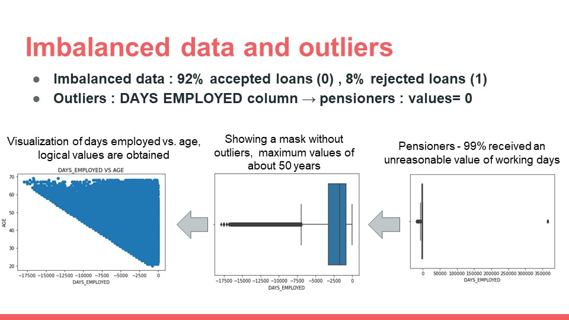

  

The repository is organized as the following:

1. [Kaggle competition's dataset](https://www.kaggle.com/competitions/home-credit-default-risk/data) includes 7 different sources of data: 

:red_square:CURRENT:red_square:
* application_train --> df_app: basic socio-economic information about each applicant at Home Credit.

:red_square:BU:red_square:
* bureau --> df_bureau: data concerning client's previous credits from other financial institutions.
* bureau_balance --> None: monthly data about the previous credits in bureau.

:red_square:HC:red_square:
* previous_application --> df_prev: previous applications for loans at Home Credit of clients who have.
* POS_CASH_balance --> df_pos: monthly data about previous point of sale or cash loans clients have had with Home Credit.
* installments_payments --> df_inst: payment history for previous loans at Home Credit.
* credit_card_balance --> None: monthly data about previous credit cards clients have had with Home Credit.

  

2. [Aggregation](https://github.com/RotemHonPauker/home_credit_default_risk/blob/master/credit_Agg.ipynb) as well as feature engineering and feature selection were executed on 5 out of the 7 sources (output files' names as mentioned above), and later [merging](https://github.com/RotemHonPauker/home_credit_default_risk/blob/master/credit_Merge.ipynb) together (output file's name: df_total.csv).

  

3. In order to retrive more insights from the data, [clustering and anomaly detection](https://github.com/RotemHonPauker/home_credit_default_risk/blob/master/credit_ClusterAnomaly.ipynb) algorithms such as hierarchical clustering and DBSCAN as well as Isolation Forest, One Class SVM and LOF, were tested. Unfortunately, non of them were useful, and further [manually reserch](https://github.com/RotemHonPauker/home_credit_default_risk/blob/master/credit_EDA.ipynb) was required. Two detected phenomena of TYPE_EDUCATIOM feature and DAYS_EMPLOYED feature are shown below. The final processed dataset which the classification models were trained and evaluated on is can be found in /csv directiory.

  

  

4. Four classification models were compared: Logistic Regression, Random Forest, XGBoost, LightGBM. [The results](https://github.com/RotemHonPauker/home_credit_default_risk/blob/master/credit_Class.ipynb) are shown below. The models' performences were examine taking in account the imbalacme and overlapping targets issues which were observed earlier.

  

  

